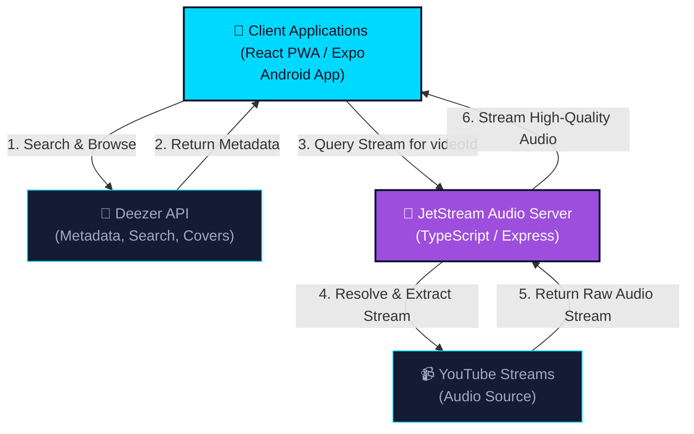

# 🎵 JetStream Music Player

<div align="center">

**A premium hybrid music streaming platform featuring a stunning glassmorphic Web UI, cross-platform Expo mobile app, and a robust Node.js audio extraction server.**

[](#)
[](#)
[](#)
[](#)
[](#)
[](#)
[](#)

*An elegant audio experience engineered with modern web and mobile architectures.*

---

[🌟 Features](#-key-features) • [🏗️ Architecture](#-system-architecture) • [🎨 Showcases](#-visual-showcase) • [🛠️ Tech Stack](#%EF%B8%8F-tech-stack) • [⚙️ Setup](#%EF%B8%8F-installation--setup) • [📂 Structure](#-project-structure) • [👤 Author](#-author)

</div>

---

## 🌟 About the Project

**JetStream** is a modular, high-performance music player designed to deliver a premium listening experience across devices. It uses a **Hybrid Streaming Architecture**: it leverages the rich catalog, search indexes, and album metadata of the **Deezer API** for discovery, and routes audio streams through a **custom Node.js/Express backend server** that extracts raw, high-fidelity audio streams directly from YouTube servers.

The client-facing applications are meticulously designed with a futuristic **Glassmorphism UI** for the Web, paired with an ultra-minimalist, performance-oriented **Expo React Native mobile application** designed strictly around a customized deep-space theme system.

---

## ✨ Key Features

### 💻 1. Glassmorphic Web Client
* **Stunning Glassmorphism UI**: Beautiful translucent surfaces, vibrant neon gradients, smooth micro-animations, and responsive layouts designed for mobile, tablet, and desktop viewports.
* **Smart Music Engine**: Seamless search & discovery powered by Deezer API with high-performance query caching (24-hour TTL using an optimized `localStorage` cache slice).
* **Advanced Waveform Visualizer**: A gorgeous real-time audio frequency visualizer built on the HTML5 Web Audio API to map audio streams into responsive visual frequencies.
* **Complete Playback Suite**: Full media player queue management (reorder, add/remove tracks), volume controls, seekable timeline with live trackers, repeat modes (none, track, queue), and shuffle.
* **Persistent Playlist Manager**: Unlimited custom playlist creation, track management, and playlist metadata editing persisting directly within the browser's sandbox.
* **Offline Resilience**: Built-in network listeners that trigger a responsive offline status indicator when connection drops.
* **Keyboard Hotkeys**: Keyboard accessibility mappings (Space for Play/Pause, Arrow keys for volume and seeking, `M` for Mute) to elevate user experience.

### 📱 2. Expo Cross-Platform Mobile Client (Android & iOS)
* **Custom Theme Design System**: A unified UI tokens library built around a strict deep-space theme (`#0A0E27` primary, `#141B34` card panels, `#00D9FF` cyber-cyan primary accent, and `#9D4EDD` purple digital accent).
* **Navigation Hierarchy**: Fluid screens transitions using Expo's Native Navigation stack.
* **Redux Toolkit Integration**: Core global state orchestration managed through highly modular slices (Auth/User, Player queue, Library, and Settings).
* **Modern Home Hub**: Premium layout featuring a "Quick Play" dashboard grid, horizontal carousels for "Recently Played" tracks with glowing covers, and personalized "Made for You" list modules.
* **Optimized Components**: Reusable high-performance cards, sliders, and interactive buttons designed for consistent 60fps renders.

### 🚀 3. Audio Extraction Backend Server
* **Server-Side Audio Resolver**: Custom TypeScript/Express API that resolves raw YouTube media streams.
* **Discord Bot-Style Streaming**: By running extraction server-side via `@distube/ytdl-core`, it mimics the audio resolution of legendary Discord music bots, resolving streams in real time while completely bypassing browser CORS constraints and Google client-side player blocks.
* **Quality & Bitrate Filtering**: Intelligent stream parsers that scan YouTube audio codecs to filter and serve only the highest audio-bitrate stream container (e.g. high-quality Opus or AAC streams).
* **Health Monitoring & Speed**: Lightweight routing utilizing Express GZIP compression, Helmet security headers, rate limiting middleware, and native Express routing.

---

## 🏗️ System Architecture

JetStream implements a highly efficient hybrid data flow. Review how data, metadata, and raw audio streams circulate between the web/mobile clients, the Deezer indexers, your custom extraction server, and YouTube:



---

## 🎨 Visual Showcase

To showcase the premium aesthetic of the JetStream applications, generate high-fidelity UI visual mockups using these customized image generation prompts and save them into the `/assets` directory:

### 🖥️ Web Glassmorph Dashboard
*Placeholder mockup for the desktop/web-client experience.*


> 💡 **Image Generation Prompt:**  
> *`A premium, ultra-modern glassmorphism Web UI Dashboard for a music player named 'JetStream'. Deep space dark background with vibrant cyber cyan (#00D9FF) and digital purple (#9D4EDD) neon gradients. Sleek left navigation sidebar, main content panel showing trending futuristic album art, and an integrated bottom audio player featuring play/pause controls, a seek bar, volume control, and a glowing real-time audio waveform frequency visualizer. High contrast, minimalist aesthetic, professional design.`*

### 📱 Android Mobile Interface
*Placeholder mockup for the mobile-client interface.*


> 💡 **Image Generation Prompt:**  
> *`An ultra-modern, professional dark mobile music player interface for the JetStream app. Deep space black background (#0A0E27) with cyber cyan (#00D9FF) and digital purple (#9D4EDD) glowing accents. Showing a glassmorphic floating album art card, minimalistic seek controls, a glowing waveform player timeline, and a stylized 'Recently Played' carousel. Minimalist, premium UI/UX design, iOS and Android responsive format.`*

---

## 🛠️ Tech Stack

### 💻 Client Stack (Web & Mobile)
| Category | Web Client | Mobile Client (Android/iOS) |
| :--- | :--- | :--- |
| **Framework** | React 18.2 | Expo (React Native) |
| **Language** | TypeScript 5.3 | TypeScript 5.3 |
| **Build System** | Vite 5.4 | Metro Bundler / EAS Build |
| **State Manager** | Redux Toolkit 2.5 | Redux Toolkit 2.5 |
| **Navigation** | React Router v6 | React Native Navigation |
| **Styling Core** | Vanilla CSS Modules | React Native StyleSheet / Theme Tokens |
| **Audio Pipeline** | HTML5 Audio + Web Audio API | Expo AV Engine |

### 🚀 Backend Service Stack
* **Language/Runtime**: TypeScript 5.2 + Node.js (v18+)
* **Core API Framework**: Express.js
* **Audio Parsing/Extraction**: `@distube/ytdl-core`
* **API Security**: Helmet, CORS Middleware, Rate Limiter (`express-rate-limit`)
* **Optimization**: GZIP compression (`compression` middleware)
* **DevOps / Environment**: ts-node-dev, Dotenv

---

## ⚙️ Installation & Setup

Ensure you have **Node.js (v18 or higher)** and **npm** installed on your system before setting up the workspaces.

### 1. Clone the Repository
```bash
git clone https://github.com/turjo410/jetstream-music-player.git
cd jetstream-music-player
```

### 2. Audio Backend Server Setup
Navigate to the `backend` folder, set up environment variables, install dependencies, and launch:
```bash
cd backend

# Install dependencies
npm install

# Configure environment
cp .env.example .env

# Launch development server
npm run dev
```
The server starts at `http://localhost:5000`. Test the health check endpoint: `http://localhost:5000/health`.

### 3. Glassmorphic Web Client Setup
Navigate to the `web` workspace, set up your credentials, install libraries, and start Vite:
```bash
cd ../web

# Install dependencies
npm install

# Configure environment
cp .env.example .env

# Start Vite dev server
npm run dev
```
Open your browser at `http://localhost:5173`. You can register a YouTube Data API Key in the `.env` to enable full-length search resolution, or let the app automatically fall back to the public Invidious parser.

### 4. Expo Mobile App Setup
Go to the `mobile` workspace, install dependencies, and launch the Expo development CLI:
```bash
cd ../mobile

# Install dependencies
npm install

# Start Metro Bundler
npx expo start
```
* Press `a` to load the application inside an **Android Emulator** (requires Android Studio).
* Press `i` to load it in the **iOS Simulator** (macOS only, requires Xcode).
* Scan the QR Code displayed on screen with the **Expo Go app** on your physical phone to test live!

---

## 📂 Project Structure

```
jetstream-music-player/
├── backend/                       # Node.js TypeScript server
│   ├── src/
│   │   ├── config/                # DB and env configurations
│   │   ├── middlewares/           # Helmet, rate-limit, and handlers
│   │   ├── routes/                # auth, track, playlist, user, recommendations, & audio routes
│   │   └── index.ts               # Core server entry point
│   ├── package.json
│   └── tsconfig.json
├── web/                           # Glassmorphic React Vite application
│   ├── src/
│   │   ├── components/            # AudioVisualizer, GlassPlayer, LyricsPanel, Queue list
│   │   ├── contexts/              # Audio playback context
│   │   ├── hooks/                 # Custom React state hooks
│   │   ├── pages/                 # Home, Search, Library, Settings dashboards
│   │   ├── services/              # Deezer, Musixmatch, Soundcloud, YouTube, Storage services
│   │   ├── store/                 # Redux store configurations
│   │   └── main.tsx               # Client entry point
│   ├── public/                    # PWA assets and Service Workers
│   ├── index.html
│   └── package.json
├── mobile/                        # Cross-platform Expo React Native app
│   ├── src/
│   │   ├── components/            # Reusable UI component blocks
│   │   ├── screens/               # HomeScreen, SearchScreen, PlayerScreen, LibraryScreen
│   │   ├── navigation/            # Stack Navigator maps
│   │   └── store/                 # Redux state slices (player, library, user)
│   ├── App.tsx                    # Mobile entry point
│   └── app.json                   # Expo configs
├── shared/                        # Shared type contracts and configurations
├── assets/                        # High-fidelity showcase screenshots (mockups)
├── LICENSE                        # Open source MIT license
└── README.md                      # Professional profile showcase
```

---

## 🤝 Contributing

We welcome developers and UI/UX designers to help make JetStream even more powerful! To contribute:
1. **Fork** the project repository.
2. **Create a Feature Branch**: `git checkout -b feature/amazing-feature`.
3. **Commit Your Changes**: `git commit -m "feat: integrate real-time lyrics synchronization"`.
4. **Push to the Branch**: `git push origin feature/amazing-feature`.
5. **Open a Pull Request** explaining your enhancements.

---

## 📄 License

This project is licensed under the **MIT License** - see the [LICENSE](LICENSE) file for complete details. You are free to copy, modify, and distribute this codebase as long as the original license header is retained.

---

## 👤 Author

Developed and engineered with passion by **[turjo410](https://github.com/turjo410)**.

* Connect on [GitHub](https://github.com/turjo410) to collaborate on technical engineering projects or inspect other portfolios. Let's build something awesome together!

---

<div align="center">

**Made with ❤️ and TypeScript in 2026**

[⬆️ Back to Top](#-jetstream-music-player)

</div>
